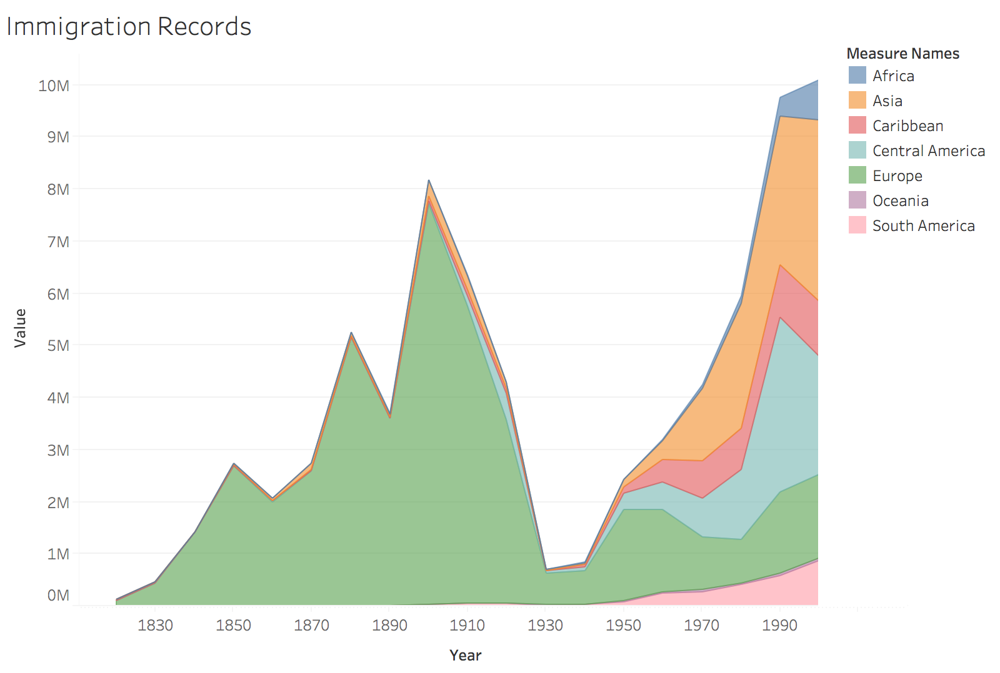

[Home](https://michaelrappa.github.io/usa-migration/) |
[Analysis](https://michaelrappa.github.io/usa-migration/pages/analysis.html) |
[Background](https://michaelrappa.github.io/usa-migration/pages/background.html) |
[Reflections](https://michaelrappa.github.io/usa-migration/pages/reflections.html) |
[Workflow](https://michaelrappa.github.io/usa-migration/pages/workflow.html) |
[Credits](https://michaelrappa.github.io/usa-migration/pages/credits.html) |
[Bibliography](https://michaelrappa.github.io/usa-migration/pages/bibliography.html) |
[Sources](https://michaelrappa.github.io/usa-migration/pages/sources.html)

---

# Introduction

Immigration plays a critical role in American society. As a topic, it is no more relevant today with our own immigration debate than it was in the early days of the republic. It is nigh inevitable when studying the course of US history to engage with immigration, no matter the area of study. With that in mind, it is extremely important to explore the intricacies of the US immigration due to its frequency and gravity. 

The face of the American nation has constantly been in flux to one degree or another, and this is in large part thanks to immigration. In its early days, the American nation consisted almost entirely of its founding stock: white, Anglo-Saxon, protestant colonists and immigrants. In the centuries to follow, it became what can be likened to a pan-European nation, as the texture of immigrants was almost exclusively from Europe, expanding from its Anglo roots. In the 20th century, the immigration demographics began to branch out beyond the boundaries of Europe, creating the modern demography of America we see today.

With that in mind, the purpose of this project is to explore immigration to the United States of America through data visualizations. The focus of this project is on immigration since the early 19th century, as the data since that point is reliable. Our level of analysis covers nationality demographics and how Immigration laws and major world events have affected immigration. By creating and analyzing these data visualizations, we hope to gain insight about the historical trends of US immigration.

